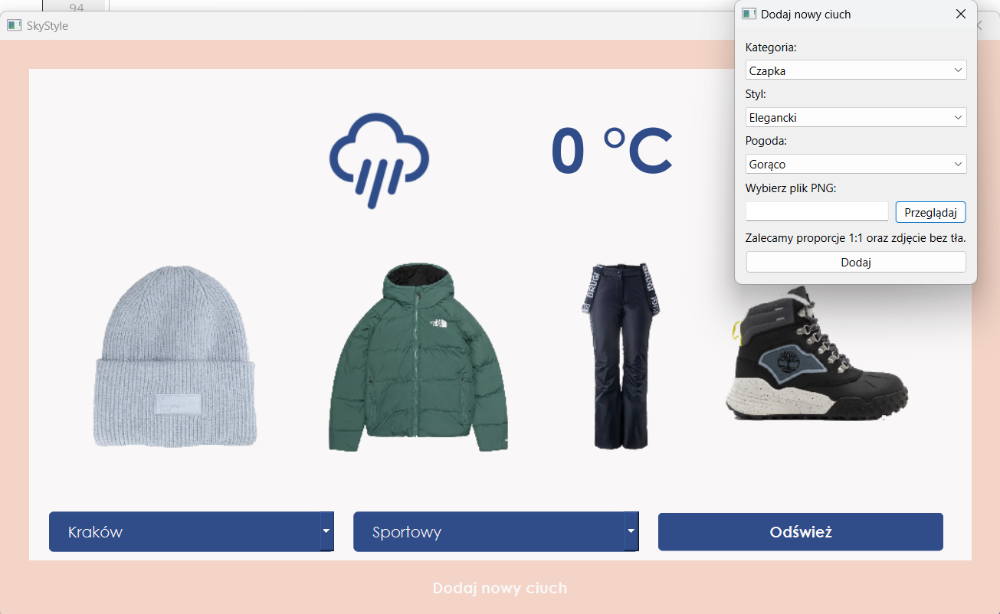

# SkyStyle 🌤️👗

Sky Style is a C++ desktop application that helps you choose an outfit for the day based on current weather conditions such as temperature and precipitation, utilizing a weather API and a custom-built database of weather-appropriate clothing. This application was developed as part of the C++ Programming course at AGH University. The project received a grade of 5.0 - 19/20 points. 🏆

## Features 🌟

- **Weather Forecast** ☁️: Retrieves weather data from an external API.
- **Outfit Selection** 👚: Matches clothing to current weather conditions using an integrated database.
- **City Presets** 🏙️: Choose from 5 demo preset cities to get weather updates and outfit recommendations.
- **Style Options** 🎨: Select from 3 styles – Casual, Elegant, and Sporty – to tailor clothing suggestions to your preference.
- **Custom Clothing** 🧥: Add your own clothing items to the database for personalized outfit recommendations.
- **Graphical Interface** 🖥️: User-friendly interface developed with Qt Creator.

## App Preview 📸

